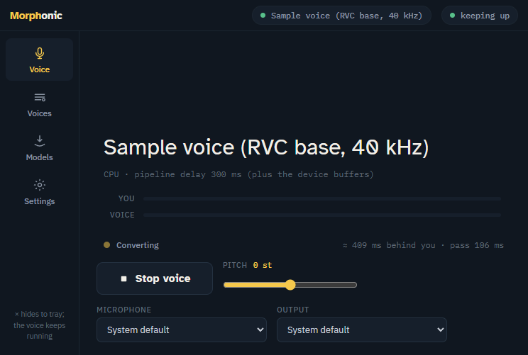

# Morphonic

A real-time RVC voice changer for Windows 11 and Fedora 44. Your microphone
goes in, a trained RVC v2 voice comes out — **on your own PC**, with nothing
sent anywhere (the only network access is downloading model files, every
one checksum-verified). Plays into a virtual microphone for games, calls
and streams, or into your headphones.

Built to the same rules and in the same style as Chatterbox: one file to
download, no installer, no accounts, no telemetry, plain logs that say what
happened.



## Download

Get the latest release from the **Releases** page:
<https://github.com/netizen-kruze/Morphonic/releases/latest>

- `Morphonic-<version>-win-x64.zip` — a single `Morphonic.exe`, no installer. The exe
  is not code-signed, so Windows SmartScreen may warn on first run — choose
  **More info → Run anyway**.
- `Morphonic-<version>-linux-x64` — one file, the whole app (the .NET runtime,
  the interface and the CPU inference runtime are inside).

Each release lists the files' SHA-256; the running app shows its version
under **Settings → About**.

**Offline variants** (`...-offline.zip` / `...-linux-x64-offline`, about
900 MB) carry the three model files inside the binary for machines without
internet: the first-run screen says "included in this build", and the Models
screen's button reads **Unpack** instead of Download. Everything else is
identical, including the hash check on every file. The small build is the
one to pick when the machine is online.

## Quick start (two minutes)

1. **Windows:** put `Morphonic.exe` in its own folder anywhere (Desktop,
   `C:\Tools\…`) and run it. **Fedora:** make the download executable and run
   it — Linux never sets that bit on a downloaded file:

   ```
   chmod +x ~/Downloads/Morphonic-<version>-linux-x64
   ~/Downloads/Morphonic-<version>-linux-x64
   ```

   If a dialog says packages are missing, it names them; on Fedora that is
   `sudo dnf install gtk3 libnotify webkit2gtk4.1 pipewire-utils`.
   **Settings → Add to app grid** (or `--install`) copies Morphonic to
   `~/.local/share/Morphonic/app/` and adds it to your app grid, no root needed.
2. On first launch, press **Set up voice conversion** (≈740 MB: the content
   encoder and the pitch model), or **Add the sample voice** to also get a
   generic voice to try (≈73 MB more). Everything comes straight from the
   original projects' Hugging Face files and is verified against pinned
   hashes; there is nothing else to install and no account to make. (Or
   from a terminal: `Morphonic --fetch-models`.)
3. Open **Voices**, press **Import voice…** and pick your RVC v2 voice — an
   `.onnx` export loads as it is; a `.pth` checkpoint shows a **Convert**
   button (see *Voices* below). Press **Use** on it.
4. Choose your **Microphone** and **Output** at the bottom of the Voice
   screen and press **Start voice**. Talk. The **You** meter shows your
   voice, the **Voice** meter the converted one, and the header chip says
   whether conversion is keeping up.

On Windows, closing the window hides Morphonic to the system tray — the voice
keeps running. Left-click the tray icon to reopen; right-click → Exit to quit.
On Linux there is no tray: closing the window quits (minimize to keep going).

## Using it in games and calls

Other programs need the converted voice as a **microphone**:

- **Fedora:** leave **Settings → Virtual microphone** on (the default).
  Morphonic creates an input called **Morphonic-Voice-Mic** while it runs and plays
  the voice into it; pick that as the microphone in VRChat (through Proton),
  Discord, OBS or any other program. Leave **Output** on *System default*
  for this — or pick **Morphonic-Voice** explicitly. Needs PipeWire with
  `pipewire-pulse` (the Fedora default).
- **Windows:** Windows has no built-in virtual cable, so install a free one
  such as **VB-CABLE** (vb-audio.com/Cable), restart, then set Morphonic's
  **Output** to **CABLE Input** and pick **CABLE Output** as the microphone
  in the other program. Morphonic points this out with a note the first time it
  sees no cable installed.

To hear yourself at the same time, set **Settings → Monitor** to your
headphones.

## Voices

Morphonic runs **RVC v2 voices with pitch guidance** (the common kind: 768-dim
ContentVec features, `f0 = 1`) — RVC v1 voices and voices trained without
pitch are refused with a message. The `.index` files that come with RVC
voices are not used; conversion runs from the features alone.

**Getting a voice in:** drop the file onto the Voices screen (`.pth`,
`.onnx`, or the `.zip` a voice library gave you — the `.pth` inside is
taken, the `.index` is ignored), press **Import voice…**, or copy it into
the voices folder (**Open folder**).

**Where voices come from.** Only the sample voice ships with Morphonic (the
RVC pretrained generator: a neutral, generic voice to prove the pipeline).
Trained voices come from the RVC community:

- **Find voices**, at the bottom of the Voices screen, searches Hugging
  Face and downloads a repository's `.pth`/`.onnx`/`.zip` straight into the
  library, verified against the SHA-256 the Hub publishes for the file.
- **weights.com**, **voice-models.com** and **Applio**'s model search are
  the big catalogs; the links on the Voices screen open them in your
  browser, then drop the download onto Morphonic.
- **Train your own** with RVC WebUI or Applio from ten minutes or more of
  clean recordings of a consenting speaker.

Voices on public libraries are uploaded by their users, mostly real people's
voices without any license. Use a voice only if you have the right to: your
own recordings, or a speaker who agreed. The app shows that reminder beside
the search.

- An **`.onnx` export** loads directly: files from `tools/morphonic_export.py`,
  from the RVC WebUI's own ONNX export, and from w-okada's voice-changer
  client are all understood. A file without metadata has its sample rate
  measured on first use.
- A **`.pth` checkpoint** (what training produces) is converted to ONNX
  **inside the app** the moment it arrives: a few seconds, nothing to
  install. The app reads the checkpoint with its own tensor-only reader
  (no code in a checkpoint can run) and places the weights into the
  embedded graph for the voice's sample rate (32, 40 or 48 kHz), the same
  mechanism that builds the sample voice.
- A checkpoint with an **unusual configuration** (a non-standard network
  layout) is beyond the embedded graphs. For those, **Settings →
  Conversion → Install fallback converter** installs the bundled Python
  tool's packages with pip (needs Python 3; PyTorch is about 2 GB), after
  which **Convert** on the voice uses it. Or run
  `python tools/morphonic_export.py voice MyVoice.pth` yourself and import the
  `.onnx`. RVC v1 voices and voices trained without pitch are refused either
  way.

The **Pitch** slider on the Voice screen transposes in semitones (a
masculine-to-feminine voice typically wants +8 to +12; the other way −8 to
−12) and applies live.

## GPU acceleration

On the CPU, a strong desktop processor converts a 250 ms block in roughly
175 ms (this is what the speed check measures). A graphics card does the
same in under 50 ms and lets you use smaller blocks for less delay. On the
**Models** screen, download **GPU acceleration** and restart:

- **Windows — DirectML** (≈215 MB): the DirectML build of ONNX Runtime plus
  Microsoft's DirectML library, from nuget.org. Works on any DirectX 12
  card — NVIDIA, AMD or Intel.
- **Fedora — CUDA** (NVIDIA only, ≈1.9 GB download, 2.9 GB on disk): the CUDA build of ONNX Runtime
  from nuget.org plus the CUDA 12 runtime it links against (cudart, cuBLAS,
  cuFFT, cuRAND, cuDNN 9, nvJitLink) from NVIDIA's own packages on PyPI,
  with NVIDIA's license texts saved beside them. When a CUDA 12 runtime is
  already installed system-wide, that copy is used and the runtime part is
  skipped. Only the driver's `libcuda.so.1` cannot be downloaded — with RPM
  Fusion's driver it comes from `xorg-x11-drv-nvidia-cuda-libs`. The CUDA
  pack has been built against the same version pins as the Windows pack but
  has **not yet been run on real Linux hardware**; `last_boot.log`'s `gpu:`
  line says what the app found, and the Models banner explains why
  acceleration is not offered when it is not.

`last_boot.log` has an `acceleration:` line with what loaded. If the GPU
runtime fails when a session starts, Morphonic says so and falls back to the
CPU for the rest of that run.

## Settings worth knowing

- **Block size** (160–500 ms): how much audio each pass converts. The
  pipeline's own delay is the block plus the crossfade (about 210 ms at
  160 ms blocks, 300 ms at 250 ms), plus the device buffers. Smaller blocks
  mean more passes per second; if the header chip turns red ("falling
  behind"), go up — Morphonic offers the fix as a one-click toast after ten
  seconds of falling behind.
- **Context** (1–2.5 s): speech before each block the encoder also sees.
  More is more natural and costs CPU time per pass.
- **Recommended defaults** picks block size and context for this machine's
  hardware tier.
- **Noise gate**, **Loudness follows you**, **Output gain**, **Speaker**
  (multi-speaker voices only), **Monitor**, **Acceleration** (Auto / GPU /
  CPU, applies after a restart), **Virtual microphone** (Linux).

## Requirements

- Windows 10/11 64-bit with the Microsoft Edge WebView2 Runtime
  (preinstalled on Windows 11; if missing, Morphonic points you to Microsoft's
  one-click installer), **or** Fedora 44 (GNOME or KDE, Wayland or X11) with
  `gtk3`, `libnotify`, `webkit2gtk4.1` and `pipewire-utils`. Any recent
  distribution with WebKitGTK 4.1 and PipeWire should run it too.
- A microphone. Other programs can keep using it at the same time (shared
  mode).
- About 1.5 GB of disk for the components and a voice; 8 GB of RAM.

## Updates and uninstalling

New versions ship as a fresh download — replace the binary. Your settings,
voices, components and the GPU pack live in `%APPDATA%\Morphonic\` (Windows) or
`~/.local/share/Morphonic/` (Linux) and survive updates.

**Settings → About → Check for updates** asks GitHub for the latest release
when you press it (never on its own) and tells you whether a newer version
exists and which file to fetch for your platform; **Open download page**
takes you to the release in your browser. Every release carries a
`SHA256SUMS.txt` so you can verify the download. Morphonic never downloads
or replaces itself.

To fully uninstall: delete the app and that data folder. Windows also keeps
one registry value under `HKEY_CURRENT_USER\Software\Morphonic` (records that
the app has run before); Linux keeps `~/.config/Morphonic/last_run`, and
`--uninstall --purge` removes everything.

## Privacy & network

Morphonic sends **no telemetry, no analytics, no pings — nothing.** Its complete
network activity:

- Downloading the files you explicitly request on the **Models** screen,
  each verified against a pinned SHA-256: the pitch model, the content
  encoder and the sample voice from Hugging Face (the RVC project's and
  ContentVec's own files, at pinned commits), the GPU pack from nuget.org
  (and, on Linux, NVIDIA's packages from PyPI).
- **Find voices** on the Voices screen: a search request to huggingface.co
  when you press Search, a file listing when you expand a result, and the
  download you choose. The three library links open in your own browser.
- **Check for updates** on the Settings screen: one request to
  api.github.com for the latest release, only when you press the button.
- Nothing else. Audio never leaves the machine. The embedded WebView2
  browser is launched with its background networking, component updates,
  crash upload and reliability pings disabled.

The optional `.pth` converter runs `pip` once at your request to install
PyTorch — that is Python's own download, outside Morphonic.

## Troubleshooting

- **Start voice is disabled**: the components must be downloaded and a
  voice chosen — the Voice screen says which is missing.
- **Nobody hears the voice**: the other program is using your real
  microphone. Pick **Morphonic-Voice-Mic** (Linux) or **CABLE Output** (Windows
  with VB-CABLE) there, and check Morphonic's **Output** points at the cable.
- **It sounds like the wrong pitch**: move the Pitch slider; voices trained
  on a much higher or lower voice than yours need ±12 semitones.
- **Stutters / "falling behind"**: a larger block, less context, or GPU
  acceleration. The toast names the fix for your machine; `last_boot.log`
  records every session's pace (passes, average and worst pass time, lag,
  underruns) for bug reports.
- **A .pth voice won't convert**: the toast shows the converter's last
  lines; "No module named torch" means the Python packages are not
  installed. Full output goes to `error.log`.
- **The window is blank** (Linux): `last_boot.log` says whether the page
  connected; on the proprietary NVIDIA driver Morphonic already switches
  WebKitGTK to its GL path.
- **Morphonic crashed or vanished**: the next start notices (a
  `boot.inprogress` marker survived), copies the OS crash record into
  `error.log`, and does a safe boot.
- Errors are logged to `error.log` in the data folder.

Bug reports are welcome — please attach `error.log`, `last_boot.log` (what
the app saw at its last start, including the machine it ran on) and, for
anything speed-related, `bench.log` from **Settings → Speed check**.
**Settings → About → Open folder** opens the folder they live in.

## Verifying on another machine

Three checks tell you within minutes whether Morphonic works on a given PC:

1. **Speed check**, in the app: **Settings → Speed check → Run** (or
   `Morphonic --bench` in a terminal). The chosen voice converts a bundled
   14-second clip block by block; the table shows load time, average and
   worst pass time against the block size, and a verdict. *fast* means the
   pass takes under half the block, *usable* under 90 %, *too slow* means
   larger blocks or GPU acceleration. The result also goes to `bench.log`.
2. **Convert a file**: `Morphonic --convert in.wav out.wav [--pitch 12]` runs a
   recording through the exact live pipeline and writes the result, so the
   voice can be judged without a microphone.
3. **Smoke test**, for testers with the repository: `.\tools\smoke.ps1` /
   `tools/smoke.sh` boot the binary against a throwaway data folder and
   report PASS or FAIL (page connected, settings read, hardware verdict,
   no crash); given a models folder they also start the voice on the default
   devices and check the session summary.

Every `last_boot.log` starts with a `machine:` line (CPU, threads, RAM,
GPUs, OS, hardware tier), so a report from any machine says what it ran on.

## Building from source

Requires the .NET 9 SDK (Windows or Linux).

```
dotnet build Morphonic.sln              # debug build + tests project
dotnet test src/Morphonic.Tests/Morphonic.Tests.csproj
.\build.ps1                         # Windows: releases\Morphonic-<ver>-win-x64.zip and the Linux binary (cross-published)
./build.sh                          # Fedora: releases/Morphonic-<ver>-linux-x64
```

The tests check the signal processing against values produced by the
original Python recipe (torch.stft, librosa's mel, RVC's RMVPE decode) for
the bundled clip; with `MORPHONIC_TEST_MODELS` pointing at a folder holding the
components and the sample voice they also run the ONNX stages against the
reference.

### Offline builds

`.\build.ps1 -Offline <models folder>` (or `./build.sh Release --offline
<models folder>`) also writes the offline variants. The folder is one the app
filled itself: `publish\Morphonic.exe --fetch-models --data-dir X`, then
pass `X\models` (the sample voice is picked up from `X\voices`). Each file is
checked against the catalog's pinned hash before it is appended; the app
reads the models back by offset from its own binary, so the offline build
starts as fast and uses as little memory as the small one. The Linux offline
file is packed by the Windows build (`--pack-offline ... --base <linux file>`)
or by the Linux build script itself.

### Model templates

Nobody publishes the content encoder or RVC's pretrained generator as an
ONNX file under a permissive license, so Morphonic does not download ONNX files
for them: it downloads the **original checkpoints** (`pytorch_model.bin` of
lengyue233/content-vec-best and `pretrained_v2/f0G40k.pth` of the RVC
project, both MIT) and assembles the ONNX files itself. The app carries
each model's graph without its weights (`src/Morphonic/Assets/*.template`) and
a recipe saying which checkpoint tensor each weight is and how the export
transformed it (copied, transposed, or weight-norm folded). The checkpoint
is read by a small pickle interpreter that knows only tensors (nothing in a
checkpoint can run code), the tensors are appended to the template as
protobuf fragments, and the result is deterministic, so the catalog pins
its hash exactly as it pins the download's.

The templates were produced from `tools/morphonic_export.py` exports with
`tools/make_templates.py template`; `tools/make_templates.py assemble`
rebuilds a model in Python to pin its hash and compare it with the export.
`MORPHONIC_TEST_SOURCES=<folder with both checkpoints> dotnet test` checks that
the app's assembly reproduces those hashes byte for byte.

## How it works

Microphone → 16 kHz → the ContentVec encoder (what is being said) and the
RMVPE pitch model (how it is sung) → the RVC synthesizer, an ONNX export of
the voice with an extra `skip_head` input so only the new block is decoded
→ SOLA alignment and crossfade with the previous block (RVC's own
real-time recipe) → the output device at the voice's rate. Inference is
ONNX Runtime; the mel front end and the pitch decoding are done in C#.

## License

Morphonic is free software under the **MIT License** — see [LICENSE](LICENSE).
Third-party credits are in [NOTICE.txt](NOTICE.txt), full third-party
license texts in [THIRD_PARTY_LICENSES.md](THIRD_PARTY_LICENSES.md), and
all of it is also shown in-app under **Settings → About**.

The RVC network code the converter uses is the MIT-licensed work of the
RVC project and w-okada's voice-changer; ContentVec (auspicious3000) and
RMVPE (yxlllc) are MIT; the models are downloaded at the user's request and
never bundled.
